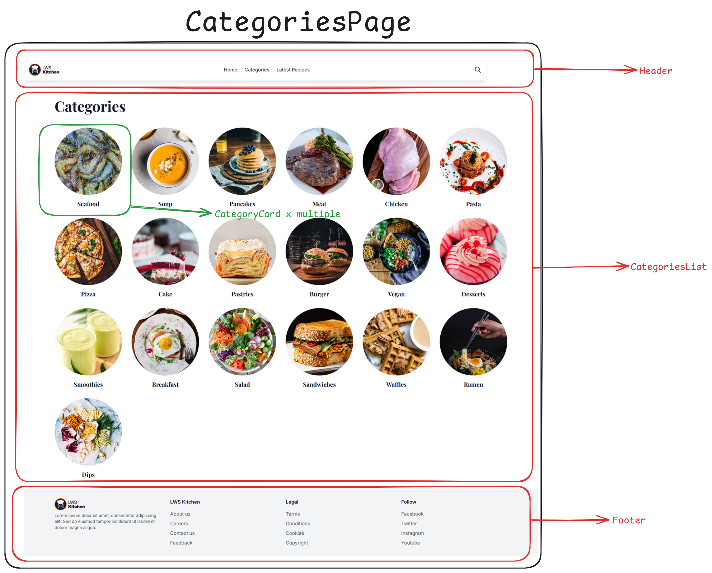
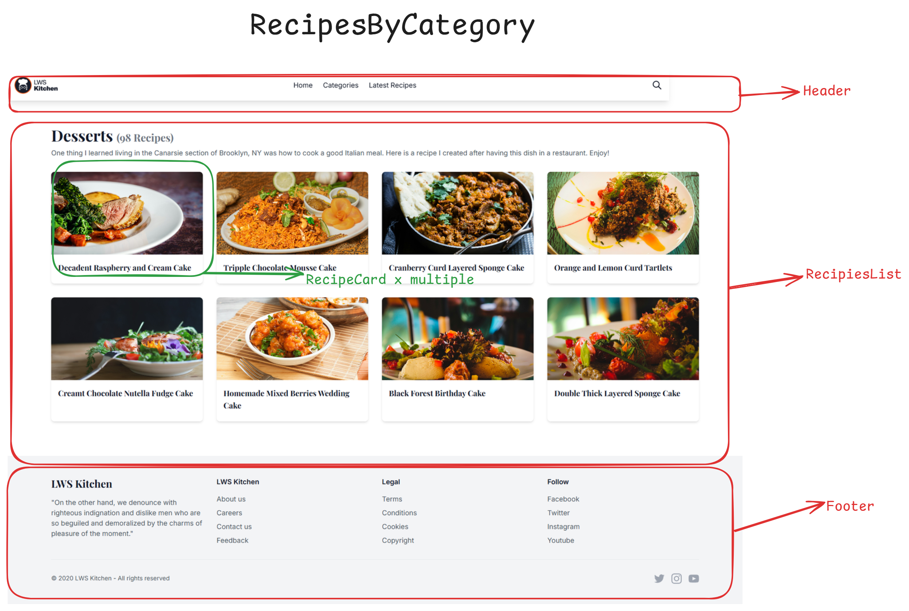
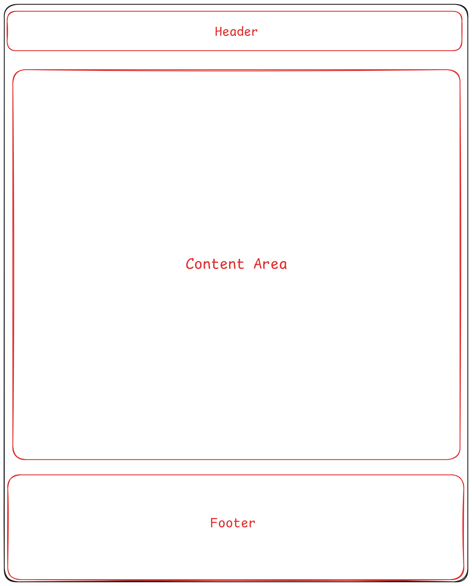

## LWS Kitchen - Food Blog and Recipes

#### This is an assignment project of Reactive Accelarator Batch -2 (Module - 7) - created with Next.js

[Click to view live](https://lws-kitchen-nextjs.vercel.app/)

### Requirement Analysis

-   [x] রেসিপি দেখানোর জন্য Structured JSON লিস্ট পাবেন এই 'dist/data' ফোল্ডার এর ভেতরে । এই ফোল্ডারের ভেতরের JSON ফাইল গুলো Parse করে আপনাকে কন্টেন্ট লোড করতে হবে। এই এসাইনমেন্ট এ আপনি Network Call করে কোনো রেসিপি নিয়ে এসে দেখাতে পারবেন না ।

-   [x] হোম পেজে Super Delicious, Popular Categories, Hand-Picked Collections, Latest Recipes সেকশনে relevent ডেটা দিয়ে রেসিপি গুলো রেন্ডার করতে হবে ।

    -   [x] Hero সেকশনে যেকোনো একটি রেসিপি নিয়ে এসে দেখাতে পারেন ।

    any recipe randomly

    -   [x] "Super Delicious" সেকশনে রেটিং কাউন্ট এর উপর ভিত্তি করে শুধু মাত্র ৩ টি রেসিপি দেখাতে হবে । প্রত্যেকটি কার্ড এ ক্লিক করলে সেই রেসিপি এর ডিটেইলস পেজে নিয়ে যাবে ।

    -   [x] "Popular Categories" সেকশনে ৬/৮টি পপুলার ক্যাটেগরি দেখাতে হবে। যে সকল ক্যাটেগরিতে সব থেকে বেশি রেসিপি আছে, সেগুলার মধ্যে থেকে ৬/৮টি নিয়ে এসে দেখাতে হবে। যেকোনো ক্যাটেগরিতে ক্লিক করলে ঐ ক্যাটেগরির রেসিপি (recipes.html) এর পেজে নিয়ে যাবে

    -   [x] Hand-Picked Collections এ আপনি আপনার মত মত যে কোনো দুইটি রেসিপি দেখাতে পারেন ।

    -   [x] "Latest Recipes" সেকশনে তারিখের উপর ভিত্তি করে ৪ টি Recent রেসিপি নিয়ে এসে দেখাতে হবে । প্রত্যেকটি কার্ড এ ক্লিক করলে সেই রেসিপি এর ডিটেইলস পেজে নিয়ে যাবে ।

-   [x] Hero সেকশনের "View Recipe" বাটনে ক্লিক করলে সেই রেসিপি এর ডিটেইলস পেজে নিয়ে যাবে ।

-   [x] সব সময় রেসিপি এর ডিটেইলস পেজ রাউট এর স্ট্রাকচার হবে - **domain.com/:category/:recipe**

-   [x] "Popular Categories" সেকশন থেকে "View All" বা Navbar থেকে "Categories" এ ক্লিক করলে ক্যাটেগরি লিস্টিং (_category.html_) পেজে নিয়ে যাবে, সেখানে সব ক্যাটেগরি নিয়ে এসে দেখাতে হবে ।

-   [x] যে কোনো ক্যাটেগরিতে কিক্ল করলে সেই ক্যাটেগরি ক্যাটেগরির কি কি রেসিপি আছে সেগুলো দেখানোর জন্যে recipes পেজে (_recipes.html_) নিয়ে যাবে । এবং সেই সাথে কত গুলো রেসিপি আছে সেগুলোর একটি সংখ্যা দেখাবে ।

-   [x] রেসিপি ডিটেইলস পেজে (_blog-details.html_) রেসিপির টাইটেল, লেখকের নাম, পাবলিশ এর তারিখ, ইমেজ এগুলো ডাইনামিক হবে। তবে এই পেজের বাকি কন্টেন্ট ডাইনামিক না করলেও চলবে । লেখকের নাম জন্যে যেকোনো Static ছবি ব্যবহার করলেই চলবে ।

-   [x] রেসিপি ডিটেইলস পেজে "You might also like" সেকশন এ ক্যাটাগরি এর ভিত্তিতে ৪ টি রেসিপি নিয়ে এসে দেখাতে হবে অর্থাৎ রেসিপি ডিটেইলস পেজে "Meat" ক্যাটেগরির একটি রেসিপি আছে, তাহলে "You might also like" সেকশনে "Meat" ক্যাটেগরির পপুলার কিছু রেসিপি নিয়ে এসে দেখাতে হবে । এবং সেগুলোতে ক্লিক করলেও যেন ঐ রেসিপি এর ডিটেইলস পেজে নিয়ে যায় ।

### Project Analysis and Mapping

